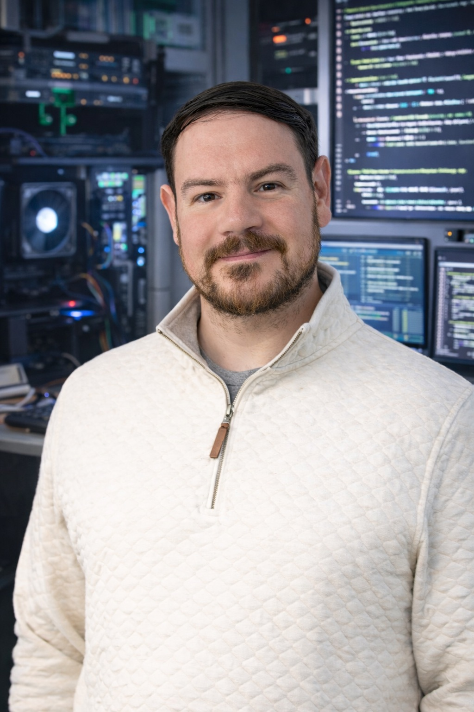

# Ben Stef

## Hero
IT system engineer focused on reliable systems and real-world fixes. I build dependable infrastructure,
solve complex problems, and keep systems running with clarity and care. Faith-driven, always learning,
and convinced there is a tech solution for almost everything.

 

This repo powers my GitHub Pages profile site: https://bstef.github.io

## About
IT system engineer focused on reliable systems and real-world fixes. I build dependable infrastructure,
solve complex problems, and keep systems running with clarity and care. Faith-driven, always learning,
and convinced there is a tech solution for almost everything.

## Focus Areas
- IT operations and reliability
- Zoom setup, optimization, and troubleshooting
- Custom website builds
- Vibe coding and creative experiments

## Selected Work
- **Zoom Support**: Setup, optimization, and troubleshooting for reliable meetings and workflows.
- **Custom Websites**: Fast, modern sites with clear messaging and smooth handoffs.
- **Troubleshooting**: Root-cause analysis and fixes for stubborn system issues.

## Connect
- LinkedIn: https://linkedin.com/in/bstef
- Website: https://bstef.com

## Location
New York City Metro. Currently employed and open to select collaborations.

---

© 2026 Ben Stef. All rights reserved.
